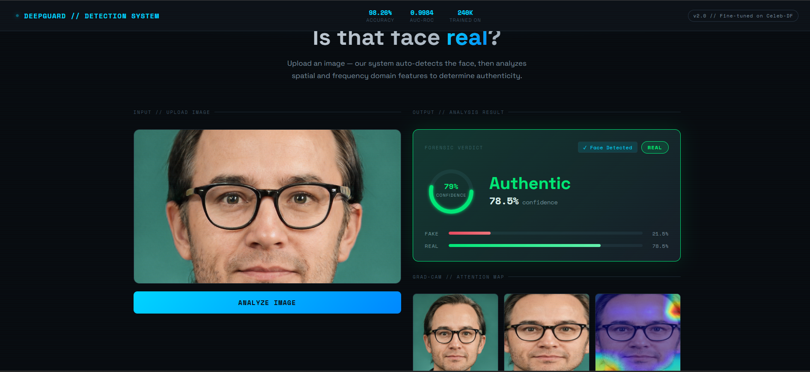

<div align="center">

# 🔍 DeepGuard — AI Deepfake Detection System

[](https://python.org)
[](https://pytorch.org)
[](https://fastapi.tiangolo.com)
[](https://reactjs.org)
[](LICENSE)

**A production-ready deepfake detection system using a novel Dual-Branch CNN architecture combining spatial and frequency domain analysis.**


[Features](#features) • [Architecture](#architecture) • [Results](#results) • [Installation](#installation) • [Usage](#usage) • [Dataset](#dataset) • [Citation](#citation)

---



</div>

---

## 📌 Overview

DeepGuard is an end-to-end deepfake detection system that identifies AI-generated or manipulated face images and videos with **98.21% accuracy** and **0.9986 AUC-ROC** across multiple deepfake generation methods.

The system was progressively trained on three datasets covering six distinct manipulation techniques — GAN-generated fakes, face-swap deepfakes, and reenactment-based manipulations — demonstrating strong cross-dataset generalization.

---

## ✨ Features

- 🧠 **Dual-Branch Architecture** — EfficientNet-B4 (spatial) + custom FFT CNN (frequency domain)
- 🔬 **Auto Face Detection** — MTCNN automatically crops faces from uploaded images
- 🎬 **Video Analysis** — Frame-by-frame analysis with fake probability graph over time
- 📦 **Batch Processing** — Analyze multiple images simultaneously
- 🗺️ **Grad-CAM Explainability** — Visualizes which facial regions triggered the prediction
- ⚖️ **Uncertainty Zone** — Flags borderline predictions (45-55% confidence) as UNCERTAIN
- 🔄 **Test-Time Augmentation** — Averages predictions on flipped inputs for robustness
- 🗄️ **Prediction History** — SQLite database stores all past predictions
- 🌐 **REST API** — FastAPI backend with full OpenAPI documentation

---

## 🏗️ Architecture

```
Input Image
     │
     ▼
┌─────────────────────────────────────────┐
│           Face Detection (MTCNN)        │
│      Crops & aligns facial region       │
└─────────────────────────────────────────┘
     │
     ├──────────────────┬──────────────────
     │                  │
     ▼                  ▼
┌──────────┐      ┌──────────────┐
│ RGB      │      │ FFT Branch   │
│ Branch   │      │              │
│          │      │ FFT map →    │
│ EfficientNet    │ Lightweight  │
│ B4       │      │ CNN          │
│          │      │              │
│ (1792-d) │      │ (128-d)      │
└──────────┘      └──────────────┘
     │                  │
     └────────┬─────────┘
              │ Concatenate (1920-d)
              ▼
     ┌─────────────────┐
     │ Fusion Head     │
     │ FC(512) → ReLU  │
     │ Dropout(0.4)    │
     │ FC(128) → ReLU  │
     │ Dropout(0.3)    │
     │ FC(2) → Softmax │
     └─────────────────┘
              │
              ▼
     REAL / FAKE / UNCERTAIN
```

**Why dual-branch?**
- RGB branch captures spatial artifacts — texture inconsistencies, blending edges, unnatural skin tones
- FFT branch detects frequency domain anomalies — GANs leave characteristic high-frequency patterns invisible to the human eye but detectable via Fast Fourier Transform

---

## 📊 Results

### Model Progression

| Model | Training Data | Test Accuracy | AUC-ROC | Test Set |
|-------|-------------|---------------|---------|----------|
| v1 | 140k faces (StyleGAN) | 98.49% | 0.9991 | 140k test |
| v1 | 140k faces | 82.85% | 0.9023 | Combined (domain gap) |
| v2 | + Celeb-DF v2 (face-swap) | 98.26% | 0.9984 | Combined |
| **v3** | **+ FaceForensics++ (6 methods)** | **98.21%** | **0.9986** | **Combined** |

### Final Model (v3) Classification Report

```
              precision    recall  f1-score   support
        Fake       0.98      0.98      0.98     15659
        Real       0.98      0.98      0.98     15294
    accuracy                           0.98     30953
```

### Datasets Covered
| Dataset | Type | Manipulation Method |
|---------|------|-------------------|
| 140k Real & Fake Faces | GAN-generated | StyleGAN |
| Celeb-DF v2 | Face-swap | Neural face replacement |
| FF++ Deepfakes | Face-swap | Autoencoder-based |
| FF++ Face2Face | Reenactment | Expression transfer |
| FF++ FaceSwap | Face-swap | GraphicsSwap |
| FF++ NeuralTextures | Reenactment | Neural texture rendering |

---

## 🗂️ Project Structure

```
deepfake/
├── backend/                    # FastAPI server
│   ├── main.py                 # API routes + inference pipeline
│   ├── models/
│   │   └── deepfake_detector_v3_final.pth   # trained model (download separately)
│   ├── history.db              # SQLite prediction history (auto-created)
│   └── requirements.txt        # Python dependencies
│
├── frontend/                   # React web app
│   ├── src/
│   │   ├── App.js              # Main UI component
│   │   └── index.js
│   ├── public/
│   └── package.json
│
├── notebooks/                  # Kaggle training notebooks
│   ├── deepfake_detector_kaggle.ipynb    # v1 training (140k)
│   ├── finetune_celebdf.ipynb            # v2 fine-tuning (+ Celeb-DF)
│   └── finetune_ffpp.ipynb              # v3 fine-tuning (+ FF++)
│
├── assets/                     # Screenshots and demo images
│   └── demo.png
│
├── .gitignore
├── LICENSE
└── README.md
```

---

## ⚙️ Installation

### Prerequisites
- Python 3.10+
- Node.js 18+
- Git

### 1. Clone the repository

```bash
git clone https://github.com/angadevgan/deepguard.git
cd deepguard
```

### 2. Download the trained model

Download `deepfake_detector_v3_final.pth` from [Google Drive](https://drive.google.com/file/d/12BfXNLgikpynqLYwE6YPcuUYhss9Ejo_/view?usp=drive_link) and place it in `backend/models/`.

### 3. Set up the backend

```bash
cd backend
python -m venv venv

# Windows
venv\Scripts\activate

# Mac/Linux
source venv/bin/activate

pip install -r requirements.txt
```

### 4. Set up the frontend

```bash
cd frontend
npm install
```

---

## 🚀 Usage

### Start the backend

```bash
cd backend
venv\Scripts\activate   # Windows
uvicorn main:app --reload --port 8000
```

Backend runs at `http://localhost:8000`
API docs available at `http://localhost:8000/docs`

### Start the frontend

```bash
cd frontend
npm start
```

Frontend opens at `http://localhost:3000`

---

## 🔌 API Endpoints

| Method | Endpoint | Description |
|--------|----------|-------------|
| `POST` | `/predict` | Single image prediction |
| `POST` | `/predict-batch` | Multiple image prediction |
| `POST` | `/predict-video` | Video frame-by-frame analysis |
| `GET` | `/history` | Retrieve prediction history |
| `DELETE` | `/history` | Clear prediction history |
| `GET` | `/stats` | Summary statistics |
| `GET` | `/` | API status |

### Example API call

```python
import requests

with open('face.jpg', 'rb') as f:
    response = requests.post(
        'http://localhost:8000/predict',
        files={'file': f}
    )

result = response.json()
print(f"Verdict: {result['verdict']}")
print(f"Fake probability: {result['fake_prob']}%")
print(f"Real probability: {result['real_prob']}%")
print(f"Face detected: {result['face_detected']}")
```

---

## 📦 Dataset

| Dataset | Source | Images |
|---------|--------|--------|
| 140k Real and Fake Faces | [Kaggle](https://www.kaggle.com/datasets/xhlulu/140k-real-and-fake-faces) | 140,000 |
| Celeb-DF v2 | [Kaggle](https://www.kaggle.com/datasets/pranabr0y/celebdf-v2image-dataset) | ~100,000 |
| FaceForensics++ | [Kaggle](https://www.kaggle.com/datasets/xdxd003/ff-c23) | ~70,000 (extracted) |

---

## 🧪 Training

Training notebooks are in the `notebooks/` folder. Each notebook is self-contained and runs on Kaggle with a free T4 GPU.

| Notebook | Purpose | GPU Time |
|----------|---------|----------|
| `deepfake_detector_kaggle.ipynb` | Train v1 from scratch | ~2.5 hrs |
| `finetune_celebdf.ipynb` | Fine-tune v2 on Celeb-DF | ~1 hr |
| `finetune_ffpp.ipynb` | Fine-tune v3 on FF++ | ~2 hrs |

---

## 🛠️ Tech Stack

**ML/Training**
- PyTorch 2.2+ with mixed-precision training
- timm (EfficientNet-B4 pretrained backbone)
- Albumentations (augmentation pipeline)
- pytorch-grad-cam (Grad-CAM explainability)
- facenet-pytorch (MTCNN face detection)
- scikit-learn (evaluation metrics)

**Backend**
- FastAPI (REST API framework)
- OpenCV (video processing)
- SQLite (prediction history)
- Uvicorn (ASGI server)

**Frontend**
- React 18
- Space Grotesk + Space Mono fonts
- Custom SVG Grad-CAM visualization
- Vanilla CSS (no Tailwind dependency)

---

## 📈 Key Technical Contributions

1. **Dual-branch fusion** — RGB spatial + FFT frequency features, novel combination not commonly found in student projects
2. **Progressive fine-tuning** — Systematic cross-dataset training covering 6 manipulation types without catastrophic forgetting
3. **Uncertainty quantification** — 45-55% confidence zone treated as UNCERTAIN instead of forced binary prediction
4. **Test-time augmentation** — Horizontal flip averaging for more robust inference
5. **Crash-proof training** — Epoch-level checkpointing enables seamless resumption
6. **Explainability** — Grad-CAM heatmaps show which facial regions triggered the detection

---

## 🙏 Acknowledgements

- [FaceForensics++](https://github.com/ondyari/FaceForensics) — Rössler et al., 2019
- [Celeb-DF](https://github.com/yuezunli/celeb-deepfakeforensics) — Li et al., 2020
- [EfficientNet](https://arxiv.org/abs/1905.11946) — Tan & Le, 2019
- [Grad-CAM](https://arxiv.org/abs/1610.02391) — Selvaraju et al., 2017

---

## 📄 License

This project is licensed under the MIT License — see the [LICENSE](LICENSE) file for details.

---

<div align="center">

⭐ Star this repo if you found it useful!

</div>
